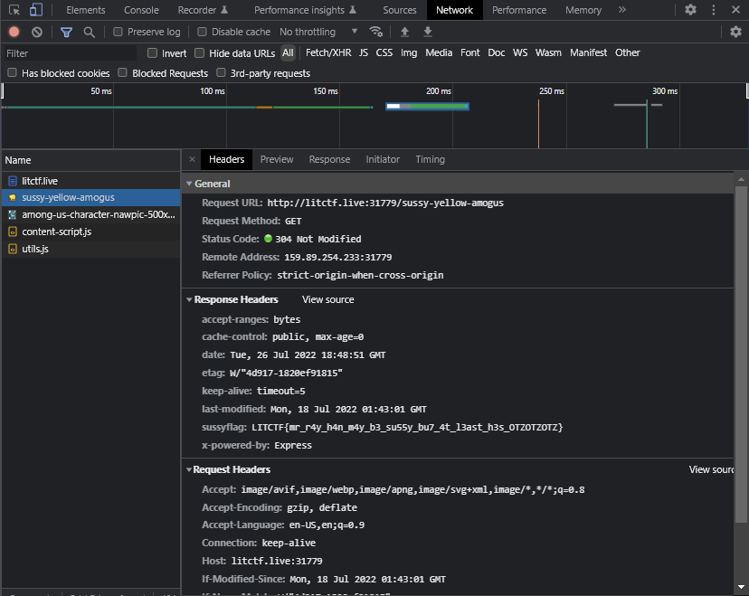

# Among Us

## Problem Statement:

Hello! I am Polopopy, and my friends like to call me Ryan. I have an unhealthy ~~fetich~~obsession with Among Us, so I made this website to demonstrate my unyielding enthusiasm!
  
## Solution

On the website, we can see a hint that says "Not gonna lie, yellow do be looking super sussy!!! With how adept he is at the rotating movement and how he's hiding his head, HE MUST BE HIDING SOMETHING!!!!!".

The bit "**and how he's hiding his head, HE MUST BE HIDING SOMETHING!!!!!**" provides us a clue to what to look for. 

Open up your browser's developer tools and navigate to the window that displays requests. This is usually labeled **Network**. 

Then, select the GIF from the requests. It should be named `sussy-yellow-amogus`. Using the hint from earlier, we can examine the **Response Headers** and see that there is a header called `sussyflag` along with the flag.

## Answer

`LITCTF{mr_r4y_h4n_m4y_b3_su55y_bu7_4t_l3ast_h3s_OTZOTZOTZ}`