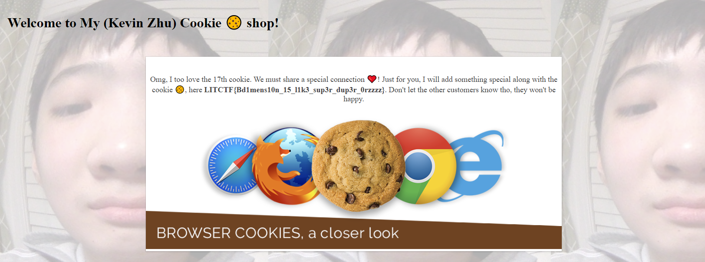

# Kevin's Cookies


## Problem Statement:


Welcome to Kevin Zhu's cookie store! I heard he sells many super delicious cookies :yum:
  

## Solution

Opening the website displays some text that says "I have so many cookies to share with you. Unfortunately, judging from your current cookies, it seems like you do not like any cookies 🍪 :<. Thus I will not bother giving you any"

The bit "**judging from your current cookies**" is a key hint in how to approach the problem.
  
  One can use the developer tools on their browser to access the cookies for the site. Upon examination, we can see there is a cookie named "**likeCookie**" with a value of `false`. Changing the value to `true` results in different text being displayed:
  
  ```Oh silly you. What do you mean you like a true cookie? I have 20 cookies numbered from 1 to 20, and all of them are made from super true authentic recipes.```

From this point, we can change the cookie's value to a number from 1-20. After some experimentation, we will see that setting the value of **likeCookie** to the number `17` yields us the flag.



## Answer

`LITCTF{Bd1mens10n_15_l1k3_sup3r_dup3r_0rzzzz}`