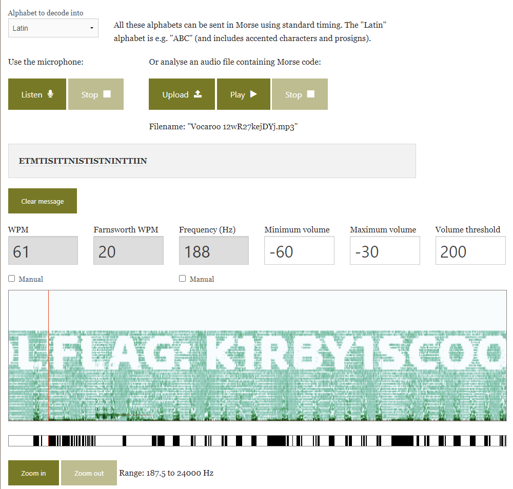

# Kevin's Cookies

## Problem Statement:

Kirby is so cool! (Wrap your flag in LITCTF{})

The beginning is very loud so you should turn down your volume.

https://vocaroo.com/12wR27kejDYj

Original song: Green Grounds from Kirby Mass Attack
  

## Solution

When one encounters an audio file in CTFs, they're usually Morse Code or some sort of audio visualization, where the audio waveform creates a message. In this case, listening to the beginning of the audio hints towards Morse code. 

We can actually utilize a tool online called [Morse Code Adaptive Audio Decoder](https://morsecode.world/international/decoder/audio-decoder-adaptive.html), which will decode the audio and output a spectrogram of the sound. 

Download the audio file and upload it to the tool. Pressing play will yield this result:

## Answer

`LITCTF{K1RBY1SCOOL}`